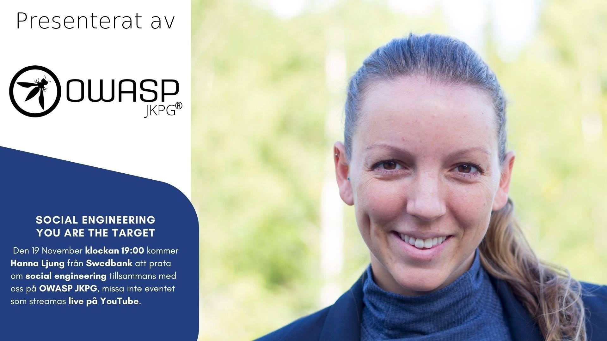
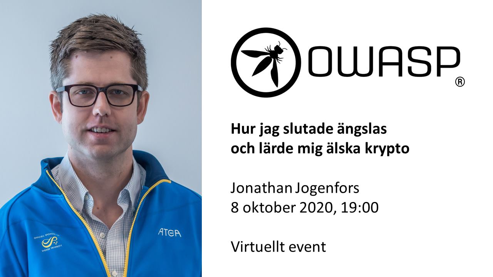

---

layout: col-sidebar
title: OWASP JKPG
tags: jkpg
type: example
altfooter: true
meetup-group: jkpg
country: Sweden
region: Europe

---

Welcome to OWASP JKPG, the local OWASP chapter for the Jönköping area in Sweden.

During the pandemic, we are broadcasting our events live on our [YouTube channel](https://www.youtube.com/channel/UC6WOZS874JpjdA_j6mhtjHQ).

The best way to stay updated on our events is to subscribe to our [mailing list](https://groups.google.com/a/owasp.org/g/jonkoping-chapter).

We also have a [Facebook page](https://www.facebook.com/owaspjkpg/).

# Upcoming events

## Social Engineering - You Are a Target 

**Speaker:** Hanna Ljung, Swedbank.

**Date:** 2020-11-19

**Time:** 19:00

**Event link:** [Watch on YouTube](https://youtu.be/Wvcd5G01lxo)

Manipulating people has always been a beneficial approach for criminals. This
also applies to our digital world. Social engineering is a tool used by
criminals in cyber-attacks and it targets the user - you. Social engineering is
about manipulating people to perform actions or disclosing confidential
information. But how does it work?

As a behavioural scientist, Hanna Ljung has a deep understanding of human
psychology and complex behaviour. She is an ethical hacker and will share real
life stories from when she herself used social engineering to attack
organizations and its users. Today, Hanna works as a security awareness expert
and her goal is to reduce human risk, "By supporting our users to become more
security-aware, we are simultaneously minimizing the cyber-criminals attack
surface".  Questions you will get answered during this session:

- What is social engineering?
- How is social engineering used in a cyber-attack?
- Why are you a target?

## The Automated Society - Dystopia, Utopia, or something in between?

**Speaker:** Niklas Lavesson, Jönköping University

**Date:** 2021-01-28

**Time:** 19:00

More details coming soon.

# Past events

## How I Learned to Stop Worrying and Love Cryptography

**Speaker:** Jonathan Jogenfors, IT security consultant, Atea

**Date and time:** 2020-10-08 19:00

**Event link:** [Watch on YouTube](https://youtu.be/HEB41hchym0)

Man kan inte ha informationssäkerhet utan krypto. Sekretess, riktighet och tillgänglighet bygger alla på att vi har robusta metoder för att kryptera, skapa digitala signaturer och göra kontrollsummor. I detta föredrag får ni en snabbkurs i hur krypto fungerar och bra tips på hur man använder det på bästa sätt för att öka sin säkerhetsnivå. Vilka är de senaste trenderna, och vilka fallgropar bör man undvika? Målet är att ni ska sluta vara oroliga för krypto!

Jonathan Jogenfors är kryptografiexpert som arbetar som senior informationssäkerhetskonsult på Atea i Jönköping. Han är med och driver OWASP JKPG och har tidigare varit forskningschef på Sectra Communications i Linköping där han arbetat med kryptoutrustning på högsta nivå. Utöver det är disputerad från Linköpings Universitet med en avhandling om kvantkryptering.

Slides: Coming soon

## Security pub

**Date:** 2019-11-07
**Time:** 17:30
**Place:** New York Legends, Lillsjöraden 16 Jönköping

We had a social gathering at a local pub.

## Secure your IT environment now\!

**Date:** 2019-05-21

We discuss three low hanging fruit that are easy to fix yet critical for a secure organisation.

### Slides:
  - [Securing your web server](https://github.com/owaspjkpg/public/blob/master/Mars%2021%2C%202019/Secure%20your%20web%20services.pdf)
  - [Securing your email](https://github.com/owaspjkpg/public/blob/master/Mars%2021%2C%202019/Secure%20your%20email.pdf)
  - [Protecting your digital privacy](https://github.com/owaspjkpg/public/blob/master/Mars%2021%2C%202019/Digital%20Privacy.pdf)

## Defending Our Connected Society

**Date:** 2019-03-07
**Time:** 18:00

Location: Atea, Bataljonsgatan 12 Jönköping

### Defending the connected society
**Speaker:** Janne Haldesten 

Vi är alla beroende av teknik i vår vardag, liksom samhället i stort. Med ny teknologi och nya sätt att använda teknologin på har våra liv blivit lättare, samtidigt som vi också blivit allt mer sårbara. Under en timme kommer Janne Haldesten att ge ett helikopterperspektiv över teknikutvecklingen, de hot och risker som denna för med sig samt hur detta kan exploateras och för vilka syften.

Janne Haldesten is a fairly seasoned specialist and adviser who lives and breathes cybersecurity. He currently works for Sectyne, a company which he also is the co-founder of. He has close to two decades of domain experience where he has worked as an adviser and expert to various government organisations and corporations nationally and internationally in matters relating to technical cyber security, national security, cyberspace operations, critical infrastructure protection, intelligence and information assurance.

Janne is often invited as speaker/panellist at events worldwide (e.g. Estonia, Finland, Sweden, Spain, United Kingdom, United States).

###The world's largest cyber defence exercise Locked Shields
**Speaker:** Thomas Svensson
Hur förbereder man sig på att hantera större IT-attacker? Att öva under kontrollerbara former är ett sätt. Thomas Svensson kommer presentera hur en av världens största cyberförsvarsövningar planeras och genomförs.

Thomas är biträdande övningsledare för Locked Shields som genomförs årligen med idag mer än 30 länder involverade.

Thomas Svensson 32 years in the Swedish Armed Forces as a specialist in telecom, radio and IT-security; 9 years in private sector as CISO at atsec information security AB

Slides only shared with attendees and not published online.

## 2018-11-01
Håkan Sonesson and Christoffer Claesson told us all about how to gather
and leverage from publicly and semi-public information about our IT
systems.
